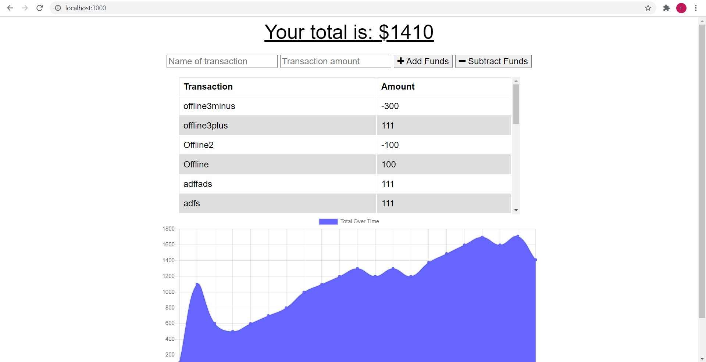

# Budget Tracker

## Table of Contents

- [Description](#description)
- [Technologies](#technologies)
- [Links](#links)

## Description

This application is an budget tracker that dynamically updates with user input. A user should input an expense/revenue name and amount and submit and they will see the graph and total update without reloading the page. The Application works with offline use as well as long as you clear the cache and reloading in an online state.

**Visuals**:  This image shows the example of the employee app in use.

## Technologies

- Express
- Mongo
- Mongoose
- Javascript
- HTML
- CSS
- JQuery

## Links

This was working, and then broke without me changing anything. The local version works as intended I was not able to troubleshoot the heroku page to get working again. It says it is missing an app to run against yet did not have that issue at first deployment.
- [Live on Heroku](https://vast-savannah-49808.herokuapp.com/)

